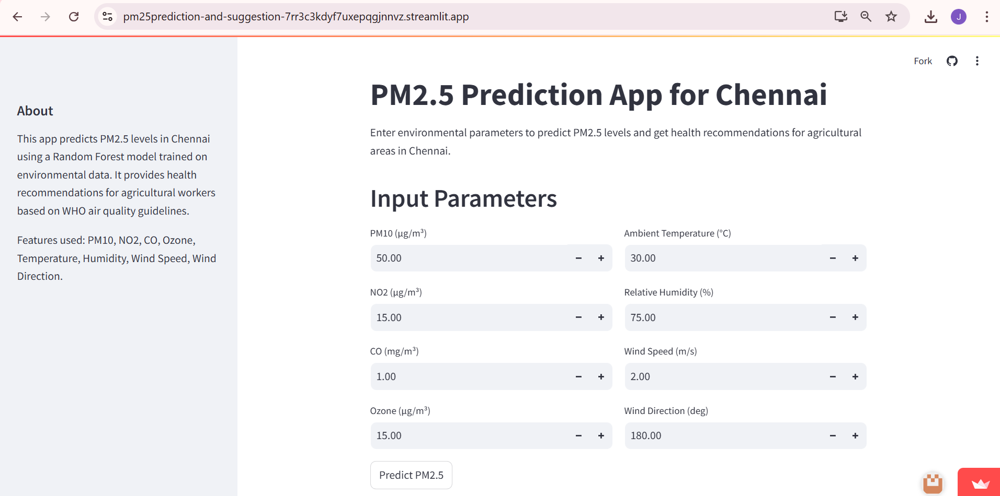

# pm25Prediction-and-suggestion
app link
https://pm25prediction-and-suggestion-7rr3c3kdyf7uxepqgjnnvz.streamlit.app/

---

## **Project Summary: PM2.5 Prediction and Health Recommendations for Agricultural Areas in Chennai**

### **About**

This project is a **Streamlit web application** that predicts the **PM2.5 (Particulate Matter 2.5)** levels based on various environmental parameters in the city of **Chennai**. The application is designed for agricultural workers and stakeholders to understand air quality levels and receive relevant **health recommendations** to mitigate the impacts of air pollution on human health and crop productivity.

### **Key Features**

1. **Environmental Parameter Input:**

   * The app allows users to input a variety of environmental parameters, including:

     * **PM10 (µg/m³)**
     * **NO2 (µg/m³)**
     * **CO (mg/m³)**
     * **Ozone (µg/m³)**
     * **Ambient Temperature (°C)**
     * **Relative Humidity (%)**
     * **Wind Speed (m/s)**
     * **Wind Direction (°)**

2. **Prediction and Classification:**

   * Upon input, the app uses a **pre-trained machine learning model** to predict the **PM2.5** level in Chennai based on the provided data.
   * The prediction is generated using a **Random Forest model**, which has been trained on environmental data.
   * The model then classifies the predicted PM2.5 level into one of the following **health categories**:

     * **Good**
     * **Moderate**
     * **Unhealthy for Sensitive Groups**
     * **Unhealthy**
     * **Very Unhealthy**
     * **Hazardous**

3. **Health Provisions and Recommendations:**

   * Based on the predicted PM2.5 level, the app provides **health recommendations** for agricultural workers. These recommendations are designed to help minimize exposure to harmful particulate matter and protect workers from the detrimental effects of poor air quality.

     * For example, if the air quality is classified as **"Hazardous"**, the app advises staying indoors, wearing an N95 mask, and using air purifiers. If the air quality is **"Good"**, outdoor activities are safe, and no precautions are needed.

4. **Real-Time Usage:**

   * The app offers real-time predictions, making it an excellent tool for agricultural planners, farm managers, and workers to assess the air quality in the region before engaging in outdoor activities or farming tasks.

5. **User Interface:**

   * The **Streamlit interface** is user-friendly and simple, designed to allow easy input of environmental parameters. The results are displayed instantly upon prediction, with relevant information on PM2.5 levels, health classifications, and health recommendations.

6. **Visualization:**

   * The app outputs:

     * The **predicted PM2.5 level** with two decimal places.
     * A **health category** based on WHO standards for air quality.
     * A detailed **health provision** to guide workers on how to adjust their outdoor activity based on air quality.

### **Technology Stack**

* **Streamlit**: A Python framework used for building the web app, which allows for interactive UI elements like sliders and buttons.
* **Pandas** and **Numpy**: Libraries used to handle and process the input data.
* **Joblib**: Used to load pre-trained machine learning models and scalers.
* **Scikit-learn**: A popular Python library for machine learning that includes tools for preprocessing data and training models. Here, it is used for scaling input data and making predictions with the trained Random Forest model.
* **Random Forest Model**: A machine learning model used to predict PM2.5 levels based on various environmental factors.

### **Steps to Use the App**

1. **Input the Data**: The user is prompted to enter environmental parameters, such as PM10, NO2, CO, Ozone, temperature, humidity, wind speed, and wind direction.

2. **Predict the PM2.5 Level**: After entering the parameters, the user can click the **"Predict PM2.5"** button. The app processes the data and generates a prediction for PM2.5 levels.

3. **Get Health Recommendations**: Based on the predicted PM2.5 level, the app displays a corresponding **health category** and **recommendations** for workers to follow.

4. **Side Information**: The sidebar provides additional information about the app, including its purpose, features, and details about the machine learning model used.

### **Health Recommendations Based on PM2.5 Levels**

The app provides health provisions according to the **WHO air quality guidelines**:

* **Good** (PM2.5 ≤ 12 µg/m³): Safe to engage in outdoor activities.
* **Moderate** (12.1 ≤ PM2.5 ≤ 35.4 µg/m³): Sensitive groups should reduce prolonged exposure to outdoor air.
* **Unhealthy for Sensitive Groups** (35.5 ≤ PM2.5 ≤ 55.4 µg/m³): Sensitive groups should limit outdoor activities. Others should reduce prolonged exposure.
* **Unhealthy** (55.5 ≤ PM2.5 ≤ 150.4 µg/m³): Everyone should reduce outdoor activities. Sensitive groups should stay indoors.
* **Very Unhealthy** (150.5 ≤ PM2.5 ≤ 250.4 µg/m³): Avoid outdoor activities, wear N95 masks if you must go outside.
* **Hazardous** (PM2.5 > 250.4 µg/m³): Stay indoors, wear N95 masks if going outside is unavoidable, and use air purifiers.

### **Benefits to Agricultural Workers**

* **Health Monitoring**: Helps agricultural workers and farm managers monitor air quality in real time, enabling them to make informed decisions about outdoor work and the safety of workers.
* **Worker Safety**: By adhering to the health provisions based on PM2.5 levels, workers can avoid respiratory issues and other health complications associated with poor air quality.
* **Crop Protection**: Poor air quality can have a negative impact on crop health, and this tool helps farmers assess environmental conditions that may affect crop yield and quality.

### **About the Model**

* The **Random Forest model** has been trained on historical environmental data to predict PM2.5 levels based on various air quality parameters.
* The model takes inputs like **PM10**, **NO2**, **CO**, **Ozone**, **Temperature**, **Humidity**, **Wind Speed**, and **Wind Direction**, and outputs a predicted PM2.5 value.
* The model has been optimized using techniques like feature scaling (using **StandardScaler**) to ensure accurate predictions.

---

### **Conclusion**

This application serves as a valuable tool for predicting PM2.5 levels in **Chennai** and providing **health recommendations** to agricultural workers. By integrating machine learning with environmental data, the app helps improve worker safety, protect crops, and promote sustainable farming practices in the region.

---

Let me know if you'd like to add or modify any part of this summary!

